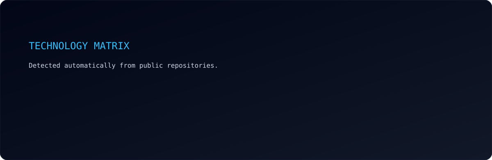

<div align="center">

<br><br>

<br><br>
<a href="https://github.com/IronWillDevops"></a>
<a href="https://github.com/IronWillDevops?tab=repositories"></a>
</div>

---

## `> whoami`

```text
+--------------------------------------------------------------------+
| $ whoami                                                            |
| IronWillDevops                                                     |
| Software / Infrastructure / DevOps / Automation                    |
|                                                                    |
| Build practical systems across application, infrastructure,        |
| networking, deployment and security layers.                        |
|                                                                    |
| Philosophy: automate repeatable work, document the system,          |
| keep infrastructure reproducible.                                  |
+--------------------------------------------------------------------+
```

## `> architecture`

```text
                         +---------------------+
                         |      INTERNET       |
                         +----------+----------+
                                    |
                         +----------v----------+
                         |       MIKROTIK      |
                         |  Routing / Firewall |
                         +----------+----------+
                                    |
                 +------------------+------------------+
                 |                                     |
          +------v------+                       +------v------+
          |   MGMT VLAN |                       |   LAN VLAN  |
          +------+------+                       +------+------+
                 |                                     |
          +------v------+                       +------+------+
          |   PROXMOX   |                       |   CLIENTS   |
          |    CLUSTER  |                       |  SERVICES   |
          +------+------+                       +-------------+
                 |
          +------+---------------+
          |      |               |
        +---+  +-------+       +---+
        | VM|  |Docker |       | CT|
        +---+  +-------+       +---+
                 |
          +------v------+
          | CI/CD / IaC |
          | Monitoring  |
          | Automation  |
          +-------------+
```

## `> stack`

<p align="center">

</p>

| Domain | Technologies |
|---|---|
| Software | PHP, Laravel, JavaScript, HTML, CSS, Tailwind CSS, Vite |
| Data | MySQL, PostgreSQL, Redis |
| Infrastructure | Linux, Docker, Docker Compose, Proxmox, Nginx |
| Networking | MikroTik, VLAN, TCP/IP, VPN, HAProxy, Keepalived |
| Microsoft | Entra ID, Intune, Active Directory, Group Policy, Autopilot |
| Automation | Bash, PowerShell, GitHub Actions, scripting |
| Security | SSH, MFA, access control, firewalling, hardening |

## `> profile.stats`

<div align="center"></div>

## `> engineering.mindset`

<div align="center">
<b>AUTOMATE</b> - eliminate repetitive work.<br>
<b>REPRODUCE</b> - infrastructure should be rebuildable.<br>
<b>OBSERVE</b> - measure before optimizing.<br>
<b>SECURE</b> - security belongs in the architecture.<br>
<b>DOCUMENT</b> - operational knowledge should be transferable.<br>
<b>SIMPLIFY</b> - reduce unnecessary complexity.
</div>

## `> current.focus`

```yaml
software:
  - PHP
  - Laravel
  - JavaScript
  - REST APIs
infrastructure:
  - Linux
  - Docker
  - Proxmox
  - Nginx
  - HAProxy
  - Keepalived
networking:
  - MikroTik
  - VLAN
  - Routing
  - Firewall
  - VPN
devops:
  - CI/CD
  - GitHub Actions
  - Infrastructure as Code
  - Automation
  - Monitoring
security:
  - SSH
  - MFA
  - Access Control
  - Endpoint Security
```

## `> technology.matrix`

<div align="center"></div>

## `> activity`

<div align="center"></div>

## `> terminal`

```bash
$ hostname
iron-will

$ systemctl status engineering
* engineering.service - Building reliable systems
  Active: active (running)

$ automation --status
[ OK ] repetitive-work
[ OK ] deployment
[ OK ] monitoring
[ OK ] documentation

$ echo $PHILOSOPHY
"Build -> Deploy -> Observe -> Automate -> Improve"
```

## `> connect`

<div align="center">
<a href="https://github.com/IronWillDevops"></a>
<br><br>
<code>Build -> Deploy -> Monitor -> Automate -> Repeat</code>
</div>

<div align="center"><sub>Profile cards are generated automatically by GitHub Actions.</sub></div>
