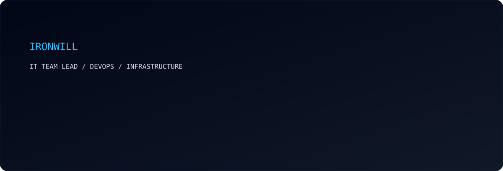
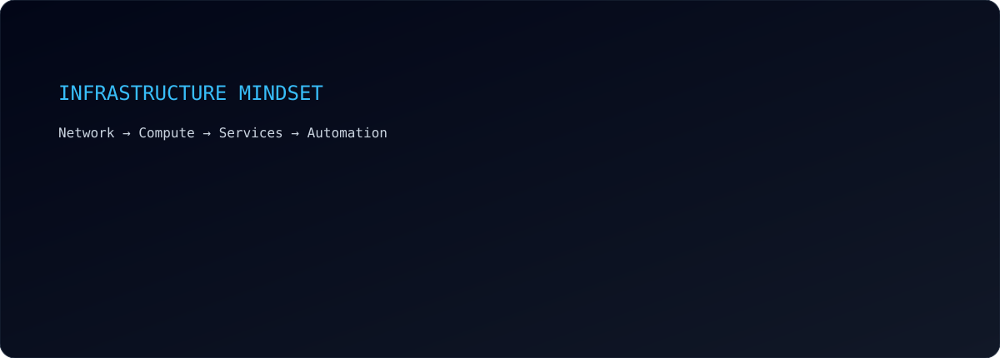
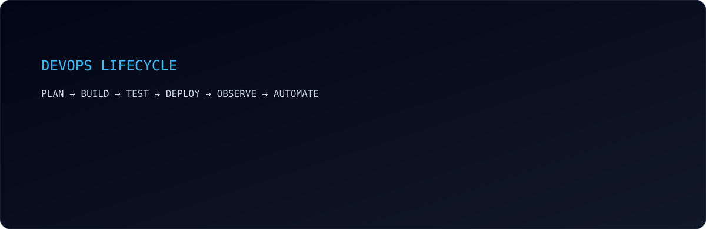
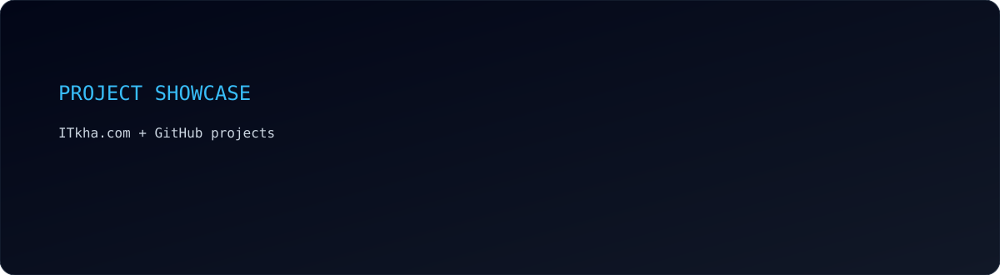
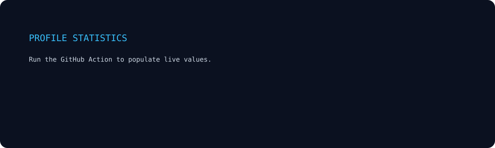
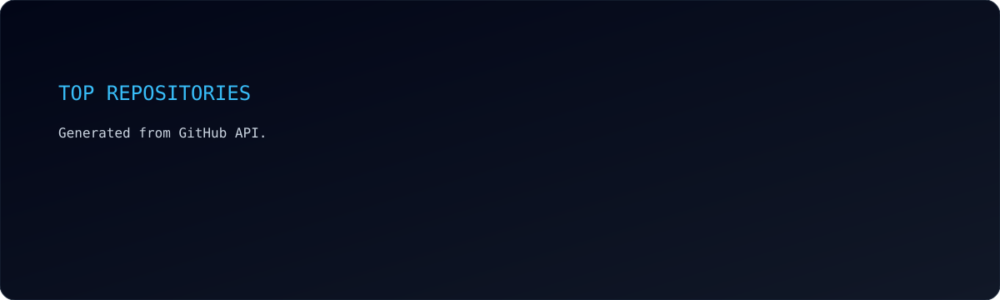
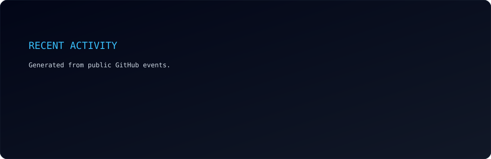
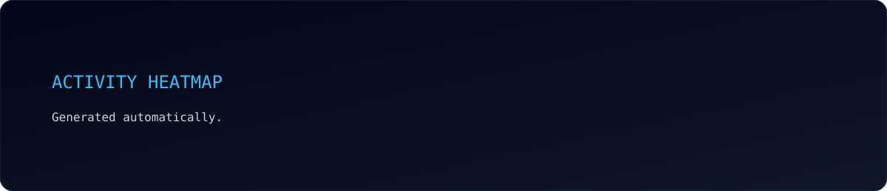

<div align="center">



<br><br>

<a href="https://itkha.com"></a>
<a href="https://github.com/IronWillDevops"></a>
<a href="https://hub.docker.com/u/ironwill98"></a>

</div>

---

<div align="center">

### `> whoami`

**Roman Nikitin** · **IT Team Lead** · **Senior DevOps / Infrastructure Engineer**

`DevOps • Infrastructure • Software Engineering`

`Remote · Kharkiv, Ukraine`

> **"Build → Deploy → Automate → Improve"**

</div>

---

## `> navigation`

<p align="center">
<a href="#about">ABOUT</a> •
<a href="#stack">STACK</a> •
<a href="#infrastructure">INFRASTRUCTURE</a> •
<a href="#devops">DEVOPS</a> •
<a href="#projects">PROJECTS</a> •
<a href="#activity">ACTIVITY</a> •
<a href="#contact">CONTACT</a>
</p>

---

## `> about`

```text
┌──────────────────────────────────────────────────────────────────────┐
│ $ whoami                                                             │
│                                                                      │
│ Roman Nikitin                                                        │
│ IT Team Lead / Senior DevOps / Infrastructure Engineer              │
│                                                                      │
│ I don't just write code.                                             │
│ I build, deploy, automate and maintain complete IT systems.          │
│                                                                      │
│ Software  ────────────────┐                                          │
│ Infrastructure ───────────┼──> Reliable systems                     │
│ Networking ───────────────┤                                          │
│ Automation ───────────────┘                                          │
│                                                                      │
│ Location: Kharkiv, Ukraine                                           │
│ Work model: Remote                                                   │
└──────────────────────────────────────────────────────────────────────┘
```

> **This is a person who can not only write code, but build and maintain a complete infrastructure.**

---

## `> stack`

<div align="center">

</div>

### Software Engineering
`PHP` · `Laravel` · `JavaScript` · `HTML` · `CSS` · `Tailwind CSS` · `Livewire` · `Vite`

### Infrastructure
`Linux` · `Ubuntu` · `Debian` · `Docker` · `Docker Compose` · `Proxmox` · `Nginx`

### Networking
`MikroTik` · `VLAN` · `VPN` · `TCP/IP` · `Firewall` · `HAProxy` · `Keepalived`

### Data
`MySQL` · `PostgreSQL` · `Redis`

### Automation
`Bash` · `PowerShell` · `GitHub Actions` · `CI/CD`

### Enterprise IT
`Microsoft Intune` · `Microsoft Entra ID` · `Active Directory` · `Group Policy` · `Windows Autopilot`

### Operations
`Graylog` · `Snipe-IT` · `Vaultwarden` · `Home Assistant`

---

## `> infrastructure`



```text
                    ┌──────────────────────────────┐
                    │          INTERNET             │
                    └──────────────┬───────────────┘
                                   │
                         ┌─────────▼─────────┐
                         │     MIKROTIK      │
                         │ Routing / Firewall│
                         └─────────┬─────────┘
                                   │
              ┌────────────────────┴────────────────────┐
              │                                         │
        ┌─────▼─────┐                             ┌─────▼─────┐
        │  VLAN 10  │                             │  VLAN 20  │
        │    LAN    │                             │    MGMT   │
        └─────┬─────┘                             └─────┬─────┘
              │                                         │
        ┌─────▼─────┐                         ┌─────────▼─────────┐
        │ Services  │                         │      PROXMOX      │
        │ Clients   │                         │      CLUSTER      │
        └───────────┘                         └─────────┬─────────┘
                                                       │
                         ┌─────────────────────────────┼───────────┐
                         │                             │           │
                    ┌────▼────┐                   ┌────▼────┐ ┌────▼────┐
                    │ Node 01 │                   │ Node 02 │ │ Node 03 │
                    └─────────┘                   └─────────┘ └─────────┘
```

---

## `> devops`



| Area | Focus |
|---|---|
| CI/CD | Automated build, test and deployment |
| Containers | Docker / Docker Compose |
| IaC | Infrastructure as Code |
| Configuration | Repeatable provisioning |
| Monitoring | Observability |
| Logging | Centralized logs |
| Backup | Recovery-first operations |
| HA | High Availability |
| Load Balancing | HAProxy / Keepalived |
| Automation | Bash / PowerShell / GitHub Actions |
| Security | Access control, MFA, segmentation and hardening |

### Currently learning

```yaml
learning:
  - Kubernetes
  - Terraform
  - Ansible
```

---

## `> projects`



### ITkha.com

**Personal IT knowledge / engineering platform**

```text
Project: ITkha.com
Focus:   IT • Infrastructure • Automation • Engineering
```

<a href="https://itkha.com"></a>

---

## `> profile.stats`



## `> top.repositories`



## `> activity`



## `> contribution`



---

## `> engineering.mindset`

<div align="center">

```text
AUTOMATE
REPRODUCE
OBSERVE
SECURE
DOCUMENT
SIMPLIFY
```

**Automate repeatable work.**  
**Make infrastructure reproducible.**  
**Observe before optimizing.**  
**Build security into architecture.**  
**Document operational knowledge.**  
**Remove unnecessary complexity.**

</div>

---

## `> terminal`

```bash
$ whoami
roman.nikitin

$ role
IT Team Lead / Senior DevOps / Infrastructure Engineer

$ location
Kharkiv, Ukraine

$ work
remote

$ systemctl status engineering
● engineering.service - Building reliable systems
   Loaded: loaded
   Active: active (running)

$ automation --status
[ OK ] infrastructure
[ OK ] deployment
[ OK ] monitoring
[ OK ] backup
[ OK ] security
[ OK ] automation

$ echo $MOTTO
"When in doubt, make a backup."
```

---

## `> contact`

<div align="center">

<a href="https://itkha.com"></a>
<a href="https://hub.docker.com/u/ironwill98"></a>
<a href="https://github.com/IronWillDevops"></a>

<br><br>

`Build → Deploy → Automate → Improve`

<br>
<sub>Profile cards are generated automatically every 24 hours.</sub>

</div>
